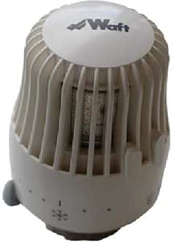

# Waft
A few days ago, I was in my home, trying to repair a radiator. And I was inspecting a piece of the radiator that was broken like this:

And in internet doesn't appreared the website of the vendor. So I thought it was a nice opportunity to start an OSINT invesigation easily.

First of all, I tried to find the website of the vendor, Waft.

You can see in the image, in the right, down, there's a website: www.waftcontrol.com.
So I tried to connect to that website, but didn't work:

That didn't work because doesn't exists www.waftcontrol.com:

So I tried to search more information using google dorks. My idea is gather information about the website when it existed. But didn't work:

I tried to use another dorks like this, but It didn't work:

To try to end this, I searched the domain "www.waftcontrol.com" in archive.org. The last copy of the website, was in 2021:

And I could find the copy of the website that I was looking for:

